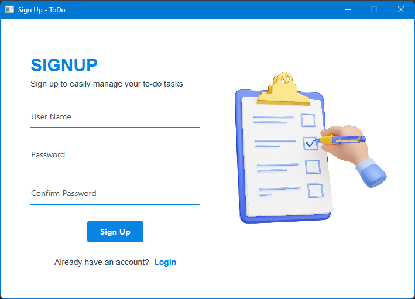
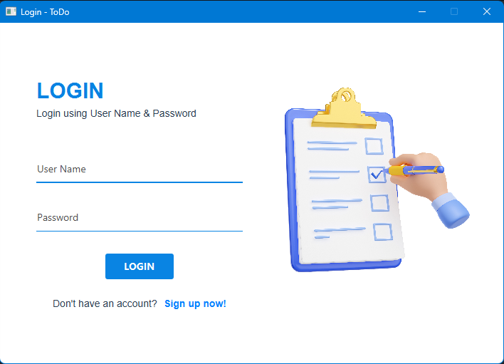
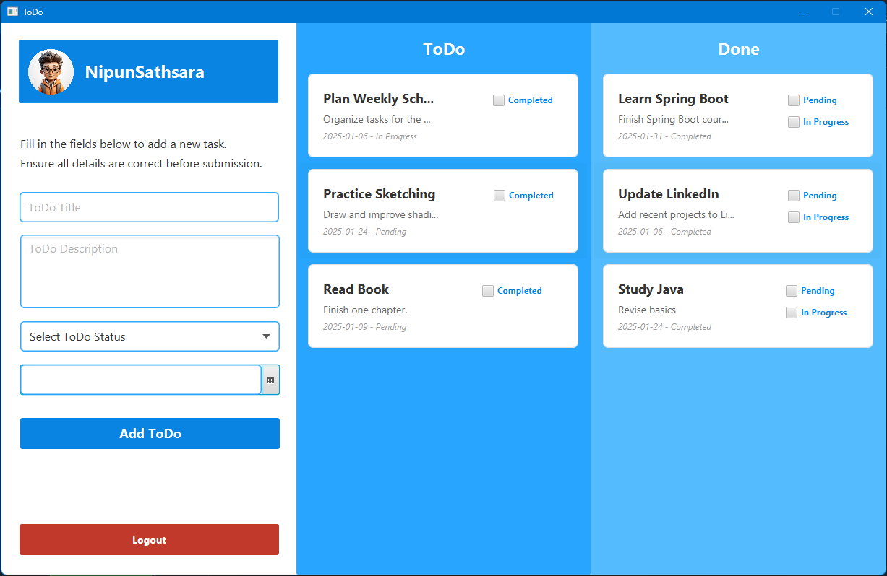

# **ToDo App**

## **Overview**
The ToDo App is a JavaFX-based desktop application that helps users manage their tasks efficiently. The app features a clean user interface and leverages database connectivity using JDBC to perform CRUD (Create, Read, Update, Delete) operations. Users can sign up, log in, and manage their to-do lists with ease.

---

## **Features**
- **User Authentication**: Sign-up, log-in, and log-out functionality.
- **Task Management**:
  - Add new to-do tasks.
  - Update the status of tasks (e.g., completed or pending).
  - Delete tasks from the list.
- **Database Integration**: Uses JDBC for seamless database connectivity to store user and task data.
- **Simple UI**: Built with JavaFX for a modern, responsive interface.

---

## **Technologies Used**
- **Programming Language**: Java
- **Framework**: JavaFX
- **Database**: JDBC connectivity for task and user management.

---

## **Project Status**
- **Completed**: The app is fully functional and ready for use.

---

## **Usage**
1. **Sign Up**: Create an account to get started.
   
2. **Log In**: Log in with your credentials to access your to-do list.
   
3. **Manage Tasks**: Add, update, or delete tasks in your to-do list.
   

---

## **Contributing**
Contributions are welcome! If you would like to contribute to this project, please fork the repository and submit a pull request with your changes. Make sure your code follows best practices.

---

## **License**
This project is licensed under the MIT License. See the LICENSE file for more details.

---

## **Credits**
- **Developer**: Nipun Basnayake
- **Libraries Used**:
  - JavaFX for UI
  - JDBC for database connectivity.

---

## **Contact**
For feedback, questions, or collaboration, reach out to:
- Email: [nipunsathsara1999@gmail.com](mailto:nipunsathsara1999@gmail.com)
- GitHub: [NipunBasnayake](https://github.com/NipunBasnayake)
